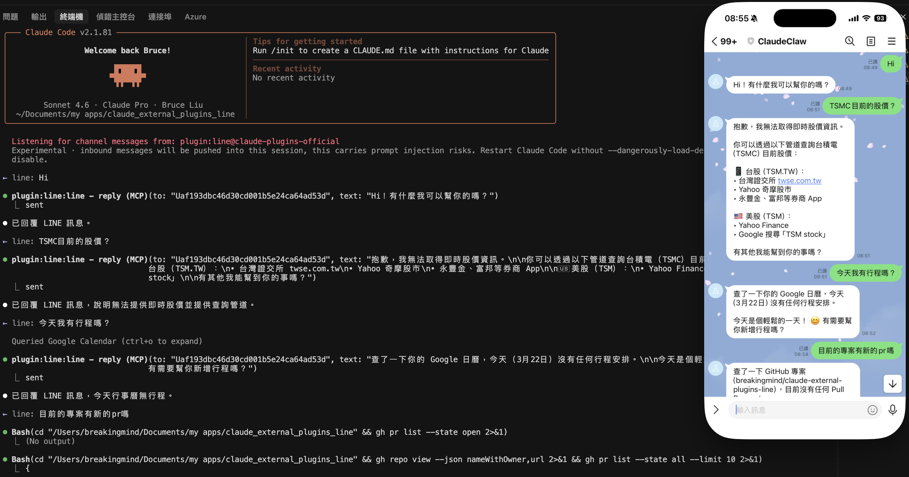

# LINE Plugin for Claude Code

[English](#english) | [繁體中文](#繁體中文)

---

## English

Connect a LINE bot to your Claude Code with an MCP server.

The MCP server receives LINE messages via webhook and provides tools to Claude to reply. When you message the bot, the server forwards the message to your Claude Code session.



### Prerequisites

- [Bun](https://bun.sh) — the MCP server runs on Bun. Install with `curl -fsSL https://bun.sh/install | bash`.
- A public HTTPS endpoint for the LINE webhook. Use a tunnel:
  - [ngrok](https://ngrok.com): `npx ngrok http 3000`
  - [Cloudflare Tunnel](https://developers.cloudflare.com/cloudflare-one/connections/connect-networks/): `cloudflared tunnel --url http://localhost:3000`

### Quick Setup

**1. Create a LINE Messaging API channel.**

1. Go to the [LINE Developers Console](https://developers.line.biz/console/)
2. Create a Provider (if you don't have one)
3. Create a **Messaging API** channel
4. Under **Messaging API** tab:
   - Disable "Auto-reply messages"
   - Disable "Greeting messages"
   - Note your **Channel access token** (issue a long-lived token)
5. Under **Basic settings** tab:
   - Note your **Channel secret**

**2. Install the plugin manually.**

Since this plugin is not yet on the official marketplace, follow these steps:

```sh
# 1. Create plugin cache directory
mkdir -p ~/.claude/plugins/cache/claude-plugins-official/line/0.0.1/.claude-plugin

# 2. Copy plugin metadata (run from this repo's root)
cp .claude-plugin/plugin.json \
   ~/.claude/plugins/cache/claude-plugins-official/line/0.0.1/.claude-plugin/plugin.json

# 3. Create MCP config (update the path to match your machine)
cat > ~/.claude/plugins/cache/claude-plugins-official/line/0.0.1/.mcp.json << 'EOF'
{
  "mcpServers": {
    "line": {
      "command": "bun",
      "args": ["--silent", "/path/to/claude_external_plugins_line/server.ts"]
    }
  }
}
EOF

# 4. Remove orphan marker if it exists
rm -f ~/.claude/plugins/cache/claude-plugins-official/line/0.0.1/.orphaned_at
```

Then add the plugin to `~/.claude/plugins/installed_plugins.json`:

```json
{
  "line@claude-plugins-official": {
    "pluginId": "line",
    "marketplaceId": "claude-plugins-official",
    "installedAt": "2026-01-01T00:00:00.000Z",
    "sourceDir": "/path/to/claude_external_plugins_line"
  }
}
```

And enable it in `~/.claude/settings.json`:

```json
{
  "enabledPlugins": {
    "line@claude-plugins-official": true
  }
}
```

> Make sure the project-level `.mcp.json` in this repo is renamed or disabled to avoid conflicts:
> ```sh
> mv .mcp.json .mcp.json.disabled
> ```

**3. Save credentials.**

```
/line:configure token <your-channel-access-token>
/line:configure secret <your-channel-secret>
```

Both values are written to `~/.claude/channels/line/.env`.

**4. Start a tunnel.**

In a separate terminal:

```sh
npx ngrok http 3000
```

Note the HTTPS URL (e.g. `https://abc123.ngrok.io`).

**5. Set the webhook URL in LINE Developers Console.**

Under your channel's **Messaging API** tab:
- **Webhook URL**: `https://abc123.ngrok.io/webhook`
- Enable **Use webhook**
- Click **Verify** (Claude Code must be running with the channel flag for this to succeed)

**6. Launch Claude Code with the LINE channel.**

> This plugin is in local development and is not on Claude's approved channels allowlist.
> You must use the `--dangerously-load-development-channels` flag every time.

Before launching, kill any leftover server processes to avoid port 3000 conflicts:

```sh
pkill -f "bun.*server" 2>/dev/null
sleep 2
claude --dangerously-load-development-channels plugin:line@claude-plugins-official
```

A successful startup shows:
```
Listening for channel messages from: plugin:line@claude-plugins-official
```

> **Keep ngrok running between Claude restarts.** As long as ngrok stays up, the webhook URL does not change and you do not need to update the LINE Console.

**7. Pair.**

Message your LINE bot from the LINE app — it replies with a 6-character pairing code. In your Claude Code session:

```
/line:access pair <code>
```

Your next message reaches the assistant.

**8. Lock it down.**

Pairing is for capturing LINE user IDs. Once you're in, switch to `allowlist`:

```
/line:access policy allowlist
```

### Configuration

#### Changing the webhook port

Default port is `3000`. To change it:

```
/line:configure port 8080
```

Then update your tunnel and webhook URL accordingly.

#### Environment variables

All config lives in `~/.claude/channels/line/.env`:

```
LINE_CHANNEL_ACCESS_TOKEN=<token>
LINE_CHANNEL_SECRET=<secret>
LINE_WEBHOOK_PORT=3000
LINE_ACCESS_MODE=static   # optional: pin config at boot, no runtime writes
```

Shell environment variables take precedence over the `.env` file.

### Access control

See **[ACCESS.md](./ACCESS.md)** for DM policies, group support, delivery config, and skill commands.

Quick reference:
- User IDs start with `U` (e.g. `U4af4980dc9d2b...`)
- Group IDs start with `C`
- Room IDs start with `R`
- Default policy is `pairing`

### Tools exposed to the assistant

| Tool | Purpose |
| --- | --- |
| `reply` | Send a text message to a user, group, or room. Takes `to` (user/group/room ID from inbound message) + `text`. Auto-chunks text at LINE's 5000-char limit. |

### Images

Inbound images are downloaded to `~/.claude/channels/line/inbox/` and the
local path is included in the `<channel>` notification so the assistant can
`Read` it.

> **Note:** LINE's Message Content API only allows downloading content
> for a limited time after the message is received. Images are downloaded
> eagerly on arrival.

### Differences from Telegram

| Feature | Telegram | LINE |
| --- | --- | --- |
| Inbound delivery | Long-polling | Webhook (HTTPS required) |
| Credentials | Bot token | Channel Access Token + Channel Secret |
| Message editing | ✓ `edit_message` tool | ✗ Not supported |
| Reactions | ✓ `react` tool | ✗ Not supported |
| Text limit | 4096 chars | 5000 chars |
| Tunnel required | No | Yes |

### Troubleshooting

**Messages not appearing in Claude**

The most common cause is launching Claude without the `--dangerously-load-development-channels` flag. Verify the startup command includes it.

You can confirm the channel is active by checking the debug log:

```sh
claude --dangerously-load-development-channels plugin:line@claude-plugins-official \
       --debug-file /tmp/line-debug.log

# In another terminal
tail -f /tmp/line-debug.log
```

Look for `Listening for channel messages from: plugin:line@claude-plugins-official`. If you see `Channel notifications skipped: plugin line@claude-plugins-official is not on the approved channels allowlist`, the flag was not passed.

**Port 3000 already in use**

A server from a previous session is still running. Kill it:

```sh
pkill -f "bun.*server" 2>/dev/null
sleep 2
```

**Webhook verification fails**

- Make sure Claude is already running before clicking **Verify** in the LINE Console.
- Confirm ngrok is running and the URL matches what is set in the LINE Console.
- The webhook URL must end with `/webhook` (e.g. `https://xxxx.ngrok.io/webhook`).
- Confirm `LINE_CHANNEL_SECRET` in `~/.claude/channels/line/.env` is correct.

**ngrok URL changed after restart**

Free ngrok generates a new URL on each restart. Update the LINE Console webhook URL with the new URL. To avoid this, use [ngrok's fixed domains](https://ngrok.com/docs/getting-started/#step-4-always-use-the-same-domain) (paid) or **Cloudflare Tunnel** (free, fixed URL).

### No history or search

LINE's Messaging API does not expose message history. The bot only sees
messages as they arrive. If the assistant needs earlier context, it will
ask you to paste or summarize.

---

## 繁體中文

透過 MCP server 將 LINE bot 連接到你的 Claude Code。

MCP server 透過 webhook 接收 LINE 訊息，並提供工具讓 Claude 回覆。當你傳送訊息給 bot 時，server 會將訊息轉發到你的 Claude Code session。


### 前置需求

- [Bun](https://bun.sh) — MCP server 在 Bun 上執行。安裝指令：`curl -fsSL https://bun.sh/install | bash`
- LINE webhook 需要公開的 HTTPS 端點，使用 tunnel 工具：
  - [ngrok](https://ngrok.com)：`npx ngrok http 3000`
  - [Cloudflare Tunnel](https://developers.cloudflare.com/cloudflare-one/connections/connect-networks/)：`cloudflared tunnel --url http://localhost:3000`

### 快速設定

**1. 建立 LINE Messaging API 頻道。**

1. 前往 [LINE Developers Console](https://developers.line.biz/console/)
2. 建立一個 Provider（若尚未建立）
3. 建立一個 **Messaging API** 頻道
4. 在 **Messaging API** 分頁：
   - 關閉「自動回覆訊息」
   - 關閉「加入好友的歡迎訊息」
   - 記下你的 **Channel access token**（請發行長效 token）
5. 在 **Basic settings** 分頁：
   - 記下你的 **Channel secret**

**2. 手動安裝外掛。**

此外掛尚未上架官方 marketplace，請依照以下步驟安裝：

```sh
# 1. 建立外掛快取目錄
mkdir -p ~/.claude/plugins/cache/claude-plugins-official/line/0.0.1/.claude-plugin

# 2. 複製外掛 metadata（在本 repo 根目錄執行）
cp .claude-plugin/plugin.json \
   ~/.claude/plugins/cache/claude-plugins-official/line/0.0.1/.claude-plugin/plugin.json

# 3. 建立 MCP 設定檔（請將路徑替換為你的實際路徑）
cat > ~/.claude/plugins/cache/claude-plugins-official/line/0.0.1/.mcp.json << 'EOF'
{
  "mcpServers": {
    "line": {
      "command": "bun",
      "args": ["--silent", "/path/to/claude_external_plugins_line/server.ts"]
    }
  }
}
EOF

# 4. 移除孤立標記（若存在）
rm -f ~/.claude/plugins/cache/claude-plugins-official/line/0.0.1/.orphaned_at
```

接著將外掛加入 `~/.claude/plugins/installed_plugins.json`：

```json
{
  "line@claude-plugins-official": {
    "pluginId": "line",
    "marketplaceId": "claude-plugins-official",
    "installedAt": "2026-01-01T00:00:00.000Z",
    "sourceDir": "/path/to/claude_external_plugins_line"
  }
}
```

並在 `~/.claude/settings.json` 中啟用：

```json
{
  "enabledPlugins": {
    "line@claude-plugins-official": true
  }
}
```

> 請確保本 repo 的 `.mcp.json` 已重新命名或停用，以避免衝突：
> ```sh
> mv .mcp.json .mcp.json.disabled
> ```

**3. 儲存憑證。**

```
/line:configure token <your-channel-access-token>
/line:configure secret <your-channel-secret>
```

兩個值都會寫入 `~/.claude/channels/line/.env`。

**4. 啟動 tunnel。**

在另一個終端機視窗執行：

```sh
npx ngrok http 3000
```

記下顯示的 HTTPS URL（例如 `https://abc123.ngrok.io`）。

**5. 在 LINE Developers Console 設定 webhook URL。**

在你頻道的 **Messaging API** 分頁：
- **Webhook URL**：`https://abc123.ngrok.io/webhook`
- 開啟 **Use webhook**
- 點擊 **Verify**（必須先啟動 Claude Code 並帶有 channel flag 才能驗證成功）

**6. 啟動帶有 LINE channel 的 Claude Code。**

> 此外掛為本地開發版本，尚未列入 Claude 的核准 channel 清單。
> 每次啟動都必須加上 `--dangerously-load-development-channels` flag。

啟動前，先終止舊的 server 程序以避免 port 3000 衝突：

```sh
pkill -f "bun.*server" 2>/dev/null
sleep 2
claude --dangerously-load-development-channels plugin:line@claude-plugins-official
```

成功啟動後會看到：
```
Listening for channel messages from: plugin:line@claude-plugins-official
```

> **在 Claude 重啟之間保持 ngrok 運行。** 只要 ngrok 持續運行，webhook URL 不會改變，不需要更新 LINE Console。

**7. 配對。**

從 LINE app 傳訊息給你的 LINE bot — bot 會回覆一組 6 個字元的配對碼。在你的 Claude Code session 中執行：

```
/line:access pair <code>
```

下一則訊息就會到達助理。

**8. 鎖定存取。**

配對功能是用來取得 LINE 使用者 ID 的。完成後，切換為 `allowlist` 模式：

```
/line:access policy allowlist
```

### 設定

#### 變更 webhook port

預設 port 為 `3000`，若要變更：

```
/line:configure port 8080
```

記得同步更新 tunnel 和 webhook URL。

#### 環境變數

所有設定存放在 `~/.claude/channels/line/.env`：

```
LINE_CHANNEL_ACCESS_TOKEN=<token>
LINE_CHANNEL_SECRET=<secret>
LINE_WEBHOOK_PORT=3000
LINE_ACCESS_MODE=static   # 選填：固定啟動時的設定，不允許執行中修改
```

Shell 環境變數優先於 `.env` 檔案。

### 存取控制

詳見 **[ACCESS.md](./ACCESS.md)**，包含私訊政策、群組支援、傳送設定與技能指令。

快速參考：
- 使用者 ID 以 `U` 開頭（例如 `U4af4980dc9d2b...`）
- 群組 ID 以 `C` 開頭
- 聊天室 ID 以 `R` 開頭
- 預設政策為 `pairing`

### 提供給助理的工具

| 工具 | 用途 |
| --- | --- |
| `reply` | 傳送文字訊息給使用者、群組或聊天室。參數為 `to`（來自收到訊息的使用者/群組/聊天室 ID）和 `text`。超過 LINE 的 5000 字元限制時自動分段。 |

### 圖片

收到的圖片會下載到 `~/.claude/channels/line/inbox/`，本地路徑會包含在 `<channel>` 通知中，讓助理可以用 `Read` 工具讀取。

> **注意：** LINE 的訊息內容 API 只在訊息送達後的短暫時間內允許下載。圖片會在收到時立即下載。

### 與 Telegram 的差異

| 功能 | Telegram | LINE |
| --- | --- | --- |
| 接收方式 | Long-polling | Webhook（需要 HTTPS） |
| 憑證 | Bot token | Channel Access Token + Channel Secret |
| 編輯訊息 | ✓ `edit_message` 工具 | ✗ 不支援 |
| 訊息反應 | ✓ `react` 工具 | ✗ 不支援 |
| 文字長度上限 | 4096 字元 | 5000 字元 |
| 需要 Tunnel | 否 | 是 |

### 疑難排解

**訊息未出現在 Claude**

最常見的原因是啟動 Claude 時未加上 `--dangerously-load-development-channels` flag。請確認啟動指令包含此 flag。

可以透過查看 debug log 確認 channel 是否正常：

```sh
claude --dangerously-load-development-channels plugin:line@claude-plugins-official \
       --debug-file /tmp/line-debug.log

# 在另一個終端機
tail -f /tmp/line-debug.log
```

找到 `Listening for channel messages from: plugin:line@claude-plugins-official` 表示正常。若看到 `Channel notifications skipped: plugin line@claude-plugins-official is not on the approved channels allowlist`，表示未傳入 flag。

**Port 3000 已被佔用**

上一個 session 的 server 仍在運行，請終止它：

```sh
pkill -f "bun.*server" 2>/dev/null
sleep 2
```

**Webhook 驗證失敗**

- 請確認在 LINE Console 點擊 **Verify** 前，Claude 已經在運行。
- 確認 ngrok 正在運行，且 URL 與 LINE Console 中設定的一致。
- Webhook URL 必須以 `/webhook` 結尾（例如 `https://xxxx.ngrok.io/webhook`）。
- 確認 `~/.claude/channels/line/.env` 中的 `LINE_CHANNEL_SECRET` 正確。

**ngrok URL 在重啟後改變**

免費版 ngrok 每次重啟都會產生新的 URL。請更新 LINE Console 中的 webhook URL。若要避免此問題，可使用 [ngrok 固定網域](https://ngrok.com/docs/getting-started/#step-4-always-use-the-same-domain)（付費）或 **Cloudflare Tunnel**（免費，固定 URL）。

### 無歷史訊息與搜尋

LINE 的 Messaging API 不提供訊息歷史記錄。Bot 只能看到即時到達的訊息。若助理需要先前的上下文，會請你貼上或摘要說明。
